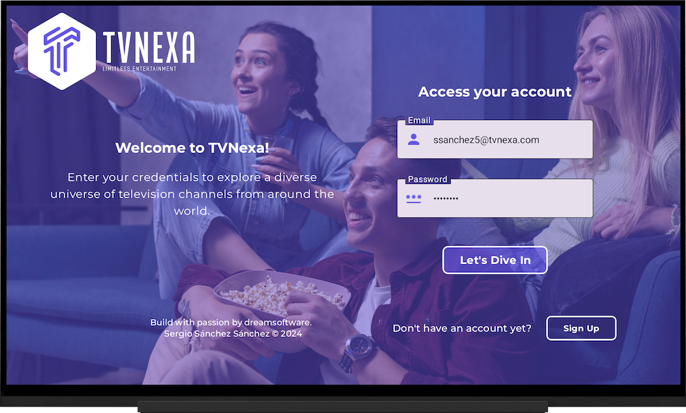
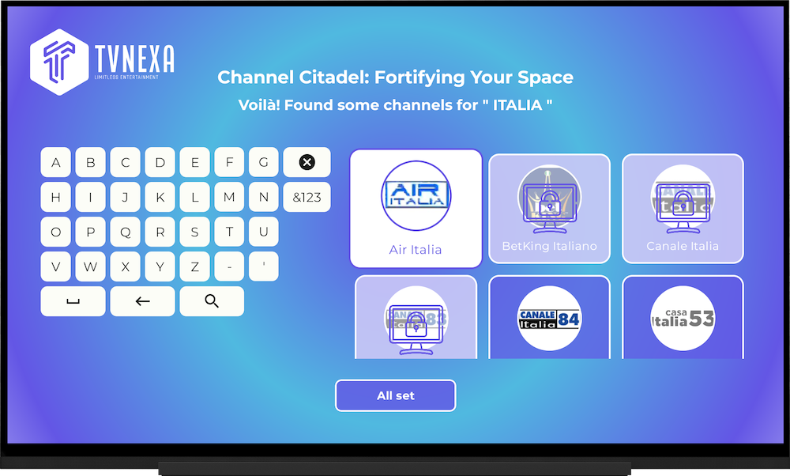

# TvNexa - My Personal Streaming Project 🌐📺

📺 **TvNexa** is a personal project focused on **improving and deepening my skills in advanced Android TV development**. The main goal is to explore and master **Jetpack Compose for TV**, learn how to effectively integrate **ExoPlayer** for media playback, and gain hands-on experience with modern libraries, tools, and best practices tailored for TV platforms.

🛠️ With **TvNexa**, I’m building and refining a streaming application that acts as a sandbox for learning. It allows me to apply **Clean Architecture**, design intuitive **TV-friendly UI/UX**, and work on performance optimization for large screen devices — all while experimenting with the latest Android technologies.

📱 The app supports **Android TV** devices, offering a clean and user-friendly interface to browse and stream live channels. While basic functionality is important, my core focus is on creating a scalable, maintainable, and production-ready experience.

🚀 This project is a personal journey into the world of **TV streaming applications**. It has become an invaluable space for technical growth, letting me push boundaries and continuously evolve as a developer in the Android TV ecosystem.

🔗 **Powered by the IPTV-org API**, TvNexa gives you access to a wide range of publicly available IPTV channels from around the world. You can explore more about this API [here](https://github.com/iptv-org/api).

🙏🙏 I want to extend my sincere gratitude to [Umair Khalid](https://github.com/UmairKhalid786) for his outstanding work on the [ComposeTv](https://github.com/UmairKhalid786/ComposeTv) repository. This repository has been an invaluable resource and a crucial starting point for my project.

Through ComposeTv, I've had the opportunity to learn and explore new techniques and concepts in development. Umair Khalid's clear documentation and high-quality code have been instrumental in my understanding and professional growth.

This app, **TvNexa**, includes images and resources designed by [Freepik](https://www.freepik.com). We would like to acknowledge and thank Freepik for their incredible design assets. The images used in the app are provided with attribution, as required by Freepik's licensing terms. For more information on Freepik's resources, please visit [www.freepik.com](https://www.freepik.com).

  
  
  
  
  

## ⚠️ Disclaimer:
This project has been developed **for educational purposes only**. The main goal of TvNexa is to learn how to develop Android TV applications using modern tools like **Jetpack Compose** and best practices.

This repository does not host any streaming or content-related materials. All IPTV channels and streaming content are sourced directly from the **IPTV-org API**, which provides publicly available IPTV channels for demonstration purposes. TvNexa serves only as a platform for showcasing how to interact with and display these channels in an Android TV app. 

Additionally, the name "**TvNexa**" was generated by AI during a brainstorming session for project ideas. Any resemblance to existing services or brands is purely coincidental.

The **logo of TvNexa** was **generated by ChatGPT** and is **free of copyright restrictions**. It is provided exclusively for **demonstration and educational purposes** and does not represent an actual brand or commercial entity.  

## Overview 🌐

**TvNexa** is a personal project built as a learning playground to improve my expertise in **Android TV development**, with a strong focus on **Jetpack Compose for TV**, **ExoPlayer integration**, and applying **modern architectural patterns** like Clean Architecture.

The goal is to create a smooth, scalable, and visually cohesive streaming experience tailored specifically for **Android TV**, while exploring the technical challenges of building for large-screen environments and remote-based navigation.

  

🎯 The core learning objectives of **TvNexa** include:

- Mastering **Jetpack Compose for TV** and **Material 3** design components
- Integrating **ExoPlayer** for robust and flexible media playback
- Managing dynamic streaming content and media sources
- Designing an intuitive **lean-back UI** optimized for TV interaction
- Building a maintainable app using **Clean Architecture** principles
- Applying performance best practices for **big-screen** devices

This project is not just about building a TV app — it’s about fully immersing myself in the **Android TV ecosystem**, sharpening my development skills, and experimenting with the latest tools and techniques for modern streaming experiences.

### **Consuming TvNexa Architecture Services**  
TvNexa utilizes **TvNexa Architecture** services, which handle the backend for managing the television content seamlessly. Working on this allowed me to gain practical experience with backend technologies, **data storage**, and API integration.

### **Backend Overview**:

The backend architecture is powered by **TvNexa Architecture**. Here are some of the key technologies and concepts I worked with to ensure efficient performance and data management:

- **Quartz Jobs for EPG Integration 🕒**: I implemented **Quartz Jobs** to handle the integration of Electronic Program Guide (EPG) data, retrieving program schedules from various sources and storing them in the **MariaDB Galera cluster** for reliable and consistent access.

- **MariaDB Galera Cluster with Jetbrains Exposed 🗃️**: Using **MariaDB Galera Cluster** for data storage and **Jetbrains Exposed** as an ORM allowed me to efficiently manage data and ensure that it’s easily retrievable for serving to end users.

- **API Development with Ktor 🚀**: Developing the API layer with **Ktor** was an exciting challenge. It enabled me to efficiently retrieve data from the MariaDB Galera cluster and serve it to the frontend for a smooth user experience.

- **Redis Cluster for Caching 🔄**: To improve the performance of the app, I integrated **Redis Cluster** as a caching solution to reduce load times and enhance the speed of data retrieval.

- **Read and Write Clusters 📚🖊️**: The backend architecture is optimized with **Read and Write clusters**, where the **Read Cluster** handles user queries via the API, and the **Write Cluster** takes care of data ingestion and updates.

This backend architecture allowed me to gain valuable experience in handling the infrastructure of a real-time streaming service and managing data at scale.

  

## User-Focused Features 🚀

Throughout the development of **TvNexa**, my main goal was to build a platform that not only showcases my learning but also offers practical and user-friendly features. These are some of the features I implemented as part of the project:

- **User Profiles**: I added functionality for creating multiple profiles, allowing users to personalize their content and enjoy a tailored experience.
- **Parental Controls**: I integrated parental control measures, including **channel blocking**, **NSFW content filtering**, and **time-based restrictions**, ensuring the app can be safely used by all family members.
- **Favorite Channels Management**: The app allows users to manage their favorite channels, helping them easily access their most-watched content.
- **Search Functionality**: Implementing a powerful search feature made it simple for users to find specific channels quickly.
- **Intuitive Navigation**: The user interface was designed with simplicity and clarity in mind, allowing easy navigation through the content.
- **Channel Categorization**: Channels are organized by **countries and categories**, following the structure provided by [iptv-org](https://github.com/iptv-org/iptv), which helps users quickly explore regional content in a more intuitive and structured way.

### **What I Learned** 💡

This project served as an excellent opportunity to improve my skills in both **Android TV development** and **backend architecture**. I focused on applying **Clean Architecture** to maintain a scalable, testable, and maintainable codebase while using modern tools like **Jetpack Compose** for building a responsive TV UI. Additionally, I gained hands-on experience with backend technologies like **MariaDB**, **Redis**, and **Ktor**, which helped me understand how to build robust, real-time systems.

The project allowed me to explore various aspects of software development, including UI/UX design, backend integration, real-time data management, and performance optimization. **TvNexa** has been a valuable learning experience

## Technical Details 🛠️

### Clean Architecture

TvNexa follows the principles of Clean Architecture, ensuring a clear separation of concerns and maintainability. The project is organized into layers – Presentation, Domain, and Data – to facilitate scalability and testability.

### Networking

Efficient communication with backend services is achieved through Retrofit and OkHttp.

### Video Playback

For a high-quality streaming experience, TvNexa leverages ExoPlayer. This powerful media player is integrated into the project to handle the playback of content.

### Jetpack Compose for TV

The user interface is built using Jetpack Compose for TV, providing a modern and declarative UI toolkit for building native Android applications.

### MVI Architecture with Clean Architecture using Jetpack Compose

TvNexa follows a robust architectural approach combining MVI (Model-View-Intent) with Clean Architecture, empowered by Jetpack Compose. This architecture ensures a clear separation of concerns, maintainability, and scalability, making TvNexa a reliable and flexible platform for streaming content.

#### MVI Architecture:
MVI architecture revolves around three main components:

1. **Model**: Represents the data state of the application. Each screen has a unified state model observed with a StateFlow, ensuring consistency and predictability across the UI. Additionally, Side Effects events are utilized to manage asynchronous tasks and other events that may not have a direct representation in the UI, ensuring smooth operation of the application.

   
2. **View**: Renders the user interface and receives user input.
   
3. **Intent**: Represents user actions or events that trigger state changes.

By adopting the MVI pattern, TvNexa achieves a unidirectional data flow, enhancing predictability and testability while minimizing side effects.

#### Clean Architecture:
TvNexa adheres to Clean Architecture principles, which include:

1. **Presentation Layer**: Responsible for rendering the UI and handling user interactions. Jetpack Compose facilitates the implementation of the presentation layer, enabling the creation of a modern and declarative UI.
   
2. **Domain Layer**: Contains the business logic and use cases of the application. This layer remains independent of any frameworks or platforms, promoting reusability and testability.
   
3. **Data Layer**: Manages data retrieval and manipulation, including interactions with external services such as backend APIs. Retrofit and OkHttp facilitate efficient communication with backend services.

#### Integration with Jetpack Compose:
Jetpack Compose is utilized throughout TvNexa to build the user interface, providing a seamless and intuitive experience for users. Compose's declarative approach simplifies UI development and enables rapid iteration, allowing TvNexa to adapt to evolving user needs efficiently.

#### Benefits:
- **Scalability** 📈: The combination of MVI and Clean Architecture allows TvNexa to scale smoothly as the application grows in complexity and functionality.
  
- **Maintainability** 🛠️: Clear separation of concerns facilitates easier maintenance and updates, ensuring TvNexa remains robust and reliable over time.
  
- **Flexibility** 🎨: Jetpack Compose's flexibility and adaptability empower TvNexa to deliver a tailored and immersive streaming experience to users across different devices and platforms.

By embracing MVI architecture with Clean Architecture and leveraging Jetpack Compose, TvNexa sets a high standard for online television platforms, prioritizing performance, maintainability, and user satisfaction.

## App Screenshots 📸

Hey there! 👋 Here are some screenshots of my **TVNexa** app to give you a sneak peek of its design and functionality. Let me walk you through the main features of the app! 🚀

### Onboarding

First up, we have the Onboarding screens 📱. If a user doesn't have an active session, they'll be redirected to the landing page 🏞️, where they can explore the app's features 📝 and navigate to the login 🔒 or create a new account screen if they don't have one yet. 🆕

  

  

  

### Sign In

Users can log in to **TVNexa** by simply entering their email and password 🔐✉️🔑. If they don't have an account, they can easily access the registration screen to create a new one 🆕

  

  

  

  

### Sign Up

On this screen, you can create your TVNexa account! 📝 Registering is quick and easy, unlocking a world of entertainment. Just fill out your name, email, and create a secure password, and boom – you're in! 🚀

  

  

  

  

### Profiles

With **TVNexa**, you can create up to **5 profiles** per account 👨‍👩‍👧‍👦✨. Each profile can have its own personalized avatar 🧑‍🤝‍🧑, alias 🆔, and even parental controls! 🔒 Block channels 🚫📺, set time limits ⏰, and manage content restrictions like NSFW 🚫👀.

  

  

  

  

  

  

  

  

  

  

### Home Channels

🏠 Welcome to the **Home** section of TVNexa! Here, you'll find the main menu to easily navigate through everything the app has to offer. You can explore channel lists by country, preview currently playing channels, and filter them by category 🎬📰🏀. Customize your experience by clicking on any channel to get more details and access extra options.

  

  

  

  

### Search Channels

Looking for something specific? 🔍 Simply type the channel name, and TVNexa will help you find it! Whether it's entertainment, news, sports, or educational content 🎬📰🏀📚, we've got you covered.

  

  

### Channel Detail

Once you find the channel you like, click on it to see more details! 📺 You can view its description, bookmark it as a favorite 🌟, and watch the stream in fullscreen for the ultimate viewing experience 🔍.

  

  

### Favorite Channels

🌟 Welcome to your **Favorite Channels** list! This section lets you access all your saved channels in one place. It's a quick way to enjoy your preferred content without any hassle. 📺🎉

  

### Full-Screen Player

Want to dive into the full-screen experience? 📺🎬 Here, you can watch your favorite shows in all their glory! And, if you like a channel, you can quickly bookmark it for future access.

  

### Settings

⚙️ Finally, welcome to **Settings**! Customize your account preferences, log out, or check out app info. If you need help, the support section is just a click away! 🛠️🔍

  

  

  

  

  

## ⚠️ Disclaimer:
This project has been developed **for educational purposes only**. The main goal of TvNexa is to learn how to develop Android TV applications using modern tools like **Jetpack Compose** and best practices.

This repository does not host any streaming or content-related materials. All IPTV channels and streaming content are sourced directly from the **IPTV-org API**, which provides publicly available IPTV channels for demonstration purposes. TvNexa serves only as a platform for showcasing how to interact with and display these channels in an Android TV app. 

Additionally, the name "**TvNexa**" was generated by AI during a brainstorming session for project ideas. Any resemblance to existing services or brands is purely coincidental.

The **logo of TvNexa** was **generated by ChatGPT** and is **free of copyright restrictions**. It is provided exclusively for **demonstration and educational purposes** and does not represent an actual brand or commercial entity.  

## Acknowledgements 🙏

We express our deep appreciation to [Freepik](https://www.freepik.es/) for generously providing the resources used in this project.

 Icons and images takes from <a href="https://www.freepik.com" title="Freepik"> Freepik </a> from <a href="https://www.flaticon.es/" title="Flaticon">www.flaticon.es'</a>

Template mockup from https://previewed.app/template/AFC0B4CB

I want to extend my sincere gratitude to [Umair Khalid](https://github.com/UmairKhalid786) for his outstanding work on the [ComposeTv](https://github.com/UmairKhalid786/ComposeTv) repository. This repository has been an invaluable resource and a crucial starting point for my project.

Through ComposeTv, I've had the opportunity to learn and explore new techniques and concepts in development. Umair Khalid's clear documentation and high-quality code have been instrumental in my understanding and professional growth.

Thanks to this repository, I've been able to not only acquire new knowledge but also effectively apply it to my project, allowing me to evolve and adapt it to my own needs and goals.

Umair Khalid's dedication and effort in sharing his work with the community are admirable. His contribution has had a significant impact on my professional and personal development, and I'm deeply grateful for it.

Once again, thank you to Umair Khalid for his generosity and for providing a solid foundation for my project. His work continues to inspire and benefit developers worldwide.

Thank you!

## Visitors Count

 
