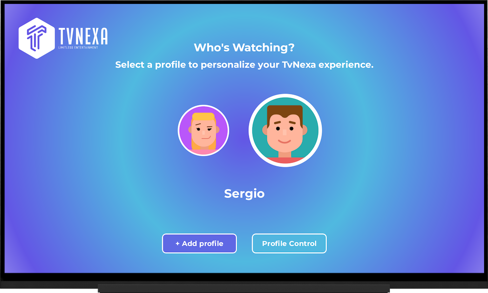

# TvNexa - Your Global IPTV Destination 🌐📺

📺 Welcome to TvNexa, your ultimate online television platform that redefines the streaming experience.

🌐 TvNexa is not just another streaming service; it's a gateway to a diverse universe of television channels from around the world. The platform is meticulously crafted with innovation at its core, ensuring that Android users have access to an unparalleled selection of global content right at their fingertips.

📱 Whether you're using Android TV, your smartphone, or tablet, TvNexa is designed for seamless exploration and enjoyment. With a user-friendly interface and intuitive features, discovering and accessing your favorite channels has never been easier.

🚀 Join us on TvNexa and embark on an extraordinary journey through the world of entertainment. Whether you're craving the latest blockbuster movies, immersive documentaries, thrilling sports events, or captivating TV shows, TvNexa has something for everyone.

🌟 Experience the future of television streaming with TvNexa – Your Global IPTV Destination. Start exploring today!

**🔜 Stay tuned! TvNexa is continuously evolving, and the mobile version will be arriving soon to enhance your streaming experience even further!**

🙏🙏 I want to extend my sincere gratitude to [Umair Khalid](https://github.com/UmairKhalid786) for his outstanding work on the [ComposeTv](https://github.com/UmairKhalid786/ComposeTv) repository. This repository has been an invaluable resource and a crucial starting point for my project.

Through ComposeTv, I've had the opportunity to learn and explore new techniques and concepts in development. Umair Khalid's clear documentation and high-quality code have been instrumental in my understanding and professional growth.

This app, **TvNexa**, includes images and resources designed by [Freepik](https://www.freepik.com). We would like to acknowledge and thank Freepik for their incredible design assets. The images used in the app are provided with attribution, as required by Freepik's licensing terms. For more information on Freepik's resources, please visit [www.freepik.com](https://www.freepik.com).

  
  
  
  
  

## Overview 🌐

🌐 **TvNexa: Bringing the World to Your Screen! 📺** TvNexa is an innovative online television platform developed for Android TV using Jetpack Compose for TV and Jetpack Material 3. The project also includes a mobile version for a consistent viewing experience across devices.

  

**Consuming TvNexa Architecture Services:** TvNexa leverages the services provided by TvNexa Architecture, which offers a robust backend infrastructure for handling diverse television content. For detailed information about the backend architecture and services, please refer to [TvNexa Architecture](https://github.com/sergio11/tvnexa_architecture).

**Backend Overview**:

The backend architecture of TvNexa, powered by TvNexa Architecture, is designed to efficiently manage the diverse range of television content available on the platform. Here's a brief overview:

- **Quartz Jobs for EPG Integration 🕒**: Quartz Jobs manage the integration of electronic program guide (EPG) data into TvNexa. They retrieve detailed program information from various sources and store it in the MariaDB Galera cluster.
  
- **MariaDB Galera Cluster with Jetbrains Exposed 🗃️**: TvNexa utilizes a MariaDB Galera cluster for efficient and secure data storage. Jetbrains Exposed is integrated to manage data storage and retrieval within the cluster.
  
- **API Development with Ktor 🚀**: The API layer is developed using the Ktor framework, facilitating rapid and efficient data retrieval from MariaDB Galera to serve end-users.
  
- **Redis Cluster for Caching 🔄**: Redis Cluster is implemented as a caching system to enhance data retrieval performance through the Ktor API.
  
- **Read and Write Clusters 📚🖊️**: The storage environment is divided into Read and Write clusters to optimize data access. The Read Cluster serves end-users via the Ktor API, while the Write Cluster handles data ingestion and updates.

This backend architecture ensures a seamless and enriching experience for users on the TvNexa platform.

  

## User-Focused Features 🚀

- **User Profiles**: Create multiple profiles on your account for personalized experiences.
- **Parental Controls**: Apply parental control measures, including channel blocking, NSFW content blocking, and time restrictions.
- **Favorite Channels Management**: Easily manage and organize your favorite channels.
- **Search Functionality**: Search for specific channels with ease.
- **Intuitive Navigation**: Enjoy a simple and intuitive navigation experience.
- **Channel Categorization**: Channels are classified by categories and countries for easy browsing.
- **Electronic Program Guide (EPG)**: Access channel schedules and program information through the EPG.

## Technical Details 🛠️

### Clean Architecture

TvNexa follows the principles of Clean Architecture, ensuring a clear separation of concerns and maintainability. The project is organized into layers – Presentation, Domain, and Data – to facilitate scalability and testability.

### Networking

Efficient communication with backend services is achieved through Retrofit and OkHttp.

### Video Playback

For a high-quality streaming experience, TvNexa leverages ExoPlayer. This powerful media player is integrated into the project to handle the playback of HLS IPTV content.

### Jetpack Compose for TV

The user interface is built using Jetpack Compose for TV, providing a modern and declarative UI toolkit for building native Android applications.

### MVI Architecture with Clean Architecture using Jetpack Compose

TvNexa follows a robust architectural approach combining MVI (Model-View-Intent) with Clean Architecture, empowered by Jetpack Compose. This architecture ensures a clear separation of concerns, maintainability, and scalability, making TvNexa a reliable and flexible platform for streaming content.

#### MVI Architecture:
MVI architecture revolves around three main components:

1. **Model**: Represents the data state of the application. Each screen has a unified state model observed with a StateFlow, ensuring consistency and predictability across the UI. Additionally, Side Effects events are utilized to manage asynchronous tasks and other events that may not have a direct representation in the UI, ensuring smooth operation of the application.

   
2. **View**: Renders the user interface and receives user input.
   
3. **Intent**: Represents user actions or events that trigger state changes.

By adopting the MVI pattern, TvNexa achieves a unidirectional data flow, enhancing predictability and testability while minimizing side effects.

#### Clean Architecture:
TvNexa adheres to Clean Architecture principles, which include:

1. **Presentation Layer**: Responsible for rendering the UI and handling user interactions. Jetpack Compose facilitates the implementation of the presentation layer, enabling the creation of a modern and declarative UI.
   
2. **Domain Layer**: Contains the business logic and use cases of the application. This layer remains independent of any frameworks or platforms, promoting reusability and testability.
   
3. **Data Layer**: Manages data retrieval and manipulation, including interactions with external services such as backend APIs. Retrofit and OkHttp facilitate efficient communication with backend services.

#### Integration with Jetpack Compose:
Jetpack Compose is utilized throughout TvNexa to build the user interface, providing a seamless and intuitive experience for users. Compose's declarative approach simplifies UI development and enables rapid iteration, allowing TvNexa to adapt to evolving user needs efficiently.

#### Benefits:
- **Scalability** 📈: The combination of MVI and Clean Architecture allows TvNexa to scale smoothly as the application grows in complexity and functionality.
  
- **Maintainability** 🛠️: Clear separation of concerns facilitates easier maintenance and updates, ensuring TvNexa remains robust and reliable over time.
  
- **Flexibility** 🎨: Jetpack Compose's flexibility and adaptability empower TvNexa to deliver a tailored and immersive streaming experience to users across different devices and platforms.

By embracing MVI architecture with Clean Architecture and leveraging Jetpack Compose, TvNexa sets a high standard for online television platforms, prioritizing performance, maintainability, and user satisfaction.

## App Screenshots

Here are some screenshots from our app to give you a glimpse of its design and functionality.

### Onboarding

Here we have the Onboarding screens 📱, if the user doesn't have an active session, they will be redirected to the landing page 🏞️, where they can view the application presentation 📝 and navigate to the login 🔒 or create a new account screens if they don't have one. 🆕

  

  

  

### Sign In

The user will be able to log in to TVNexa by providing their email and password. If they don't have an account, they can access the registration screen to create a new one. 🔐✉️🔑 If they don't have an account, they can access the registration screen to create a new one. 🆕

  

  

  

  

### Sign Up

On this screen, you can create your account on TvNexa. Registering is quick, easy, and will open up a world of possibilities. Ready to get started?

Simply fill out the required fields, such as your name, email address, and a secure password. Make sure to choose a password that's easy to remember but hard to guess to keep your account safe.

Once you've entered all the necessary information, click "Register," and you're all set! You're now part of our community. You'll be able to access all the features and exclusive content we offer.

  

  

  

  

### Profiles

Each user on TvNexa can create up to 5 profiles to customize their experience and apply parental control rules. Each profile can be optionally protected by a security PIN, which will be required to unlock the profile. 🔒👨‍👩‍👧‍👦✨

You can personalize your profile avatar 🧑‍🤝‍🧑, set an alias 🆔, and enable options like NSFW to access channels with adult content 🚫👀. Additionally, you can utilize more advanced profile management features, such as blocking specific channels 🚫📺 or setting viewing time limits ⏰.

  

  

  

  

  

  

  

  

  

  

  

  

### Home channels

🏠 Welcome to TV Nexa's HOME!

In the HOME section, you'll find the main menu of the application, allowing you to easily navigate through all available sections. From here, you can explore the lists of channels by country, view previews of the currently selected channel, and filter them by categories to quickly find the content that interests you the most.

Additionally, you can access the details of each channel by simply clicking on it, where you'll find additional information and options to customize your viewing experience.

Don't forget to explore the various options and features that TV Nexa has to offer. Enjoy the convenience of accessing a wide variety of content from the comfort of your home!

  

  

  

  

### Search channels

Here you can search for your favorite channels by simply entering the name in the search field 🔍. Whether you're looking for entertainment shows, news, sports, or educational content 🎬📰🏀📚, we're confident you'll find something you like! Once you find a channel that interests you, simply click on it to get more information and start enjoying the content 📺👀.

  

  

### Channel detail

Here you can find detailed information about the channel you have selected. From a general description to the option to bookmark it as a favorite and watch the streaming in fullscreen, everything is at your fingertips! 📺🔍

Explore the options to learn more about the channel and its features. If you like what you see, you can bookmark the channel for easy access in the future. 🌟

Once you're ready to enjoy the content, simply click on the play button to watch the streaming in fullscreen. ▶️🔍

  

  

### Favorite channels

🌟 Welcome to your favorite channels!

This screen is your personalized space where you can easily access all your favorite channels in one place. Never miss out on your favorite shows and content!

Explore the list of channels you've marked as favorites and quickly access their live stream or on-demand content. Enjoy the convenience of having your favorite channels at your fingertips at all times! 📺🎉

  

### Full screen player

📺 Welcome to the Full-Screen Player!

Here, you can fully immerse yourself in the viewing experience of your favorite programs. Enjoy streaming in fullscreen and don't miss a single detail.

Moreover, while you're enjoying the content, you also have the option to bookmark the channel as a favorite with just one click. This way, you can easily access it in the future!

Sit back, relax, and enjoy your favorite content in all its glory with our Full-Screen Player! 🎬🔍

  

### Settings

⚙️ Welcome to Settings!

In this section, you have access to various options to manage your user account and preferences. You can view information about your user account and log out if needed. Additionally, you can find details about the developer, access help, terms and conditions, and learn more about the AndroidTV STB and the app.

If you have any questions or need assistance, don't hesitate to explore the help section or contact support for further assistance.

Enjoy customizing your experience with our app! 🛠️🔍

  

  

  

  

  

## Contribution
Contributions to TvNexa Android are highly encouraged! If you're interested in adding new features, resolving bugs, or enhancing the project's functionality, please feel free to submit pull requests.

## Credits
TvNexa is developed and maintained by Sergio Sánchez Sánchez (Dream Software). Special thanks to the open-source community and the contributors who have made this project possible. If you have any questions, feedback, or suggestions, feel free to reach out at dreamsoftware92@gmail.com.

## Acknowledgements 🙏

We express our deep appreciation to [Freepik](https://www.freepik.es/) for generously providing the resources used in this project.

 Icons and images takes from <a href="https://www.freepik.com" title="Freepik"> Freepik </a> from <a href="https://www.flaticon.es/" title="Flaticon">www.flaticon.es'</a>

Template mockup from https://previewed.app/template/AFC0B4CB

I want to extend my sincere gratitude to [Umair Khalid](https://github.com/UmairKhalid786) for his outstanding work on the [ComposeTv](https://github.com/UmairKhalid786/ComposeTv) repository. This repository has been an invaluable resource and a crucial starting point for my project.

Through ComposeTv, I've had the opportunity to learn and explore new techniques and concepts in development. Umair Khalid's clear documentation and high-quality code have been instrumental in my understanding and professional growth.

Thanks to this repository, I've been able to not only acquire new knowledge but also effectively apply it to my project, allowing me to evolve and adapt it to my own needs and goals.

Umair Khalid's dedication and effort in sharing his work with the community are admirable. His contribution has had a significant impact on my professional and personal development, and I'm deeply grateful for it.

Once again, thank you to Umair Khalid for his generosity and for providing a solid foundation for my project. His work continues to inspire and benefit developers worldwide.

Thank you!

## Visitors Count

 
 ## Please Share & Star the repository to keep me motivated.
  
